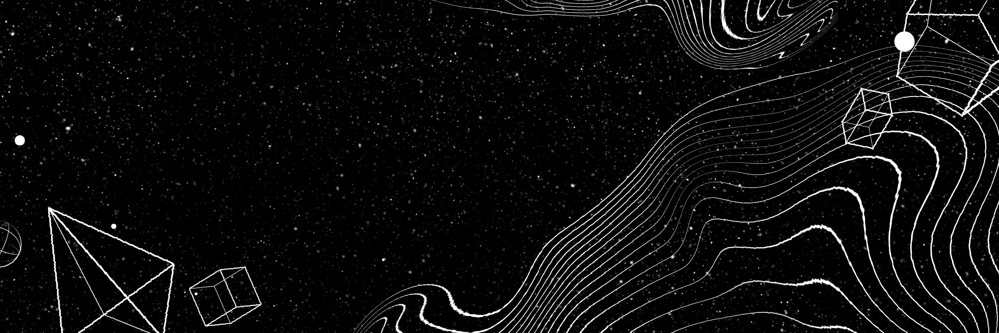

---

## Know About Me

<table>
<tr>
<td width="220" align="center">

</td>
<td>

### Hey there! I'm Hitesh

I'm a dev who turns coffee into JavaScript (and TypeScript when I'm feeling responsible). Most of my week goes into building things, breaking them, then Googling the exact error message I wrote yesterday. When I'm not in a terminal, I'm out chasing mountain passes — the real kind, not the merge-conflict kind.

</td>
</tr>
</table>

---

## 🚀 Top Projects (built to avoid being bored)

**[Crazzy07](https://github.com/Hitesh-o7/Crazzy07)** — the repo where experiments go to either thrive or set the codebase on fire.

**[time-pass](https://github.com/Hitesh-o7/time-pass)** — side quests coded purely out of boredom, no roadmap, no regrets.

---

## 🔗 Connect

> Code is never really finished, it just gets deployed before I change my mind again.
>
> Every commit is a small apology to my future self who has to read it.

---

## 📊 GitHub Stats

<!-- Proudly created with GPRM ( https://gprm.itsvg.in ) -->
